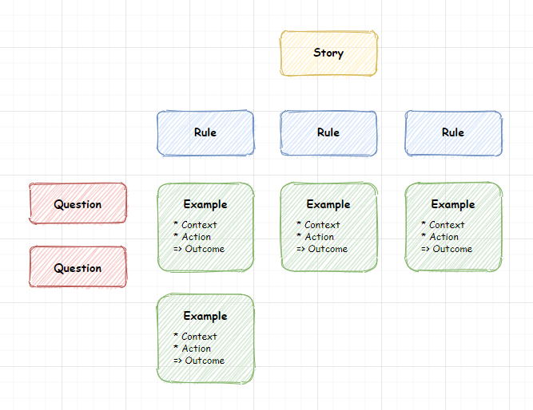

# diagrams.net-example-mapping
Example Mapping template and library for diagrams.net

Follow this link to <a href="https://app.diagrams.net/?libs=0&clibs=Uhttps%3A%2F%2Fraw.githubusercontent.com%2Ftryane%2Fdiagrams.net-example-mapping%2Fmaster%2Fexample_mapping_library.xml#Uhttps%3A%2F%2Fraw.githubusercontent.com%2Ftryane%2Fdiagrams.net-example-mapping%2Fmaster%2Fexample_mapping_template.drawio" target="_blank">start a new requirement workshop in diagrams.net</a>

